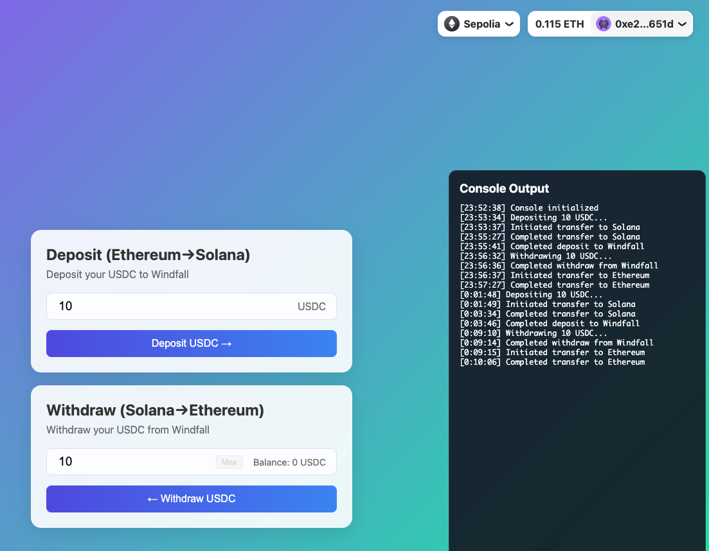
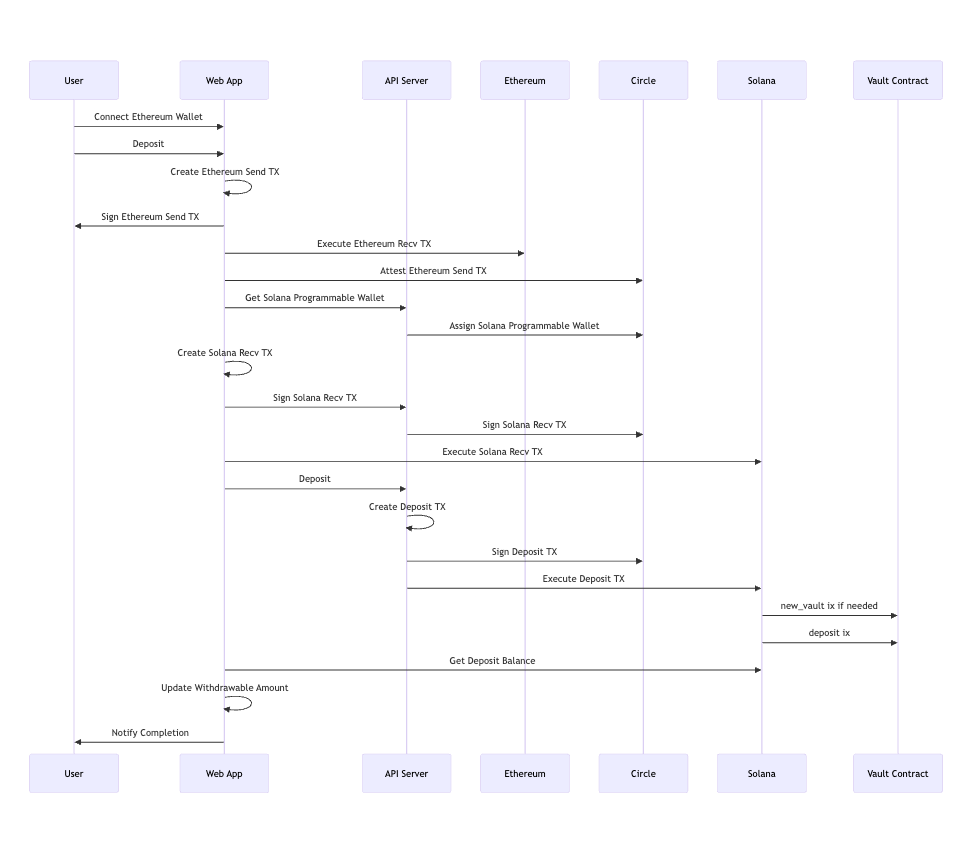
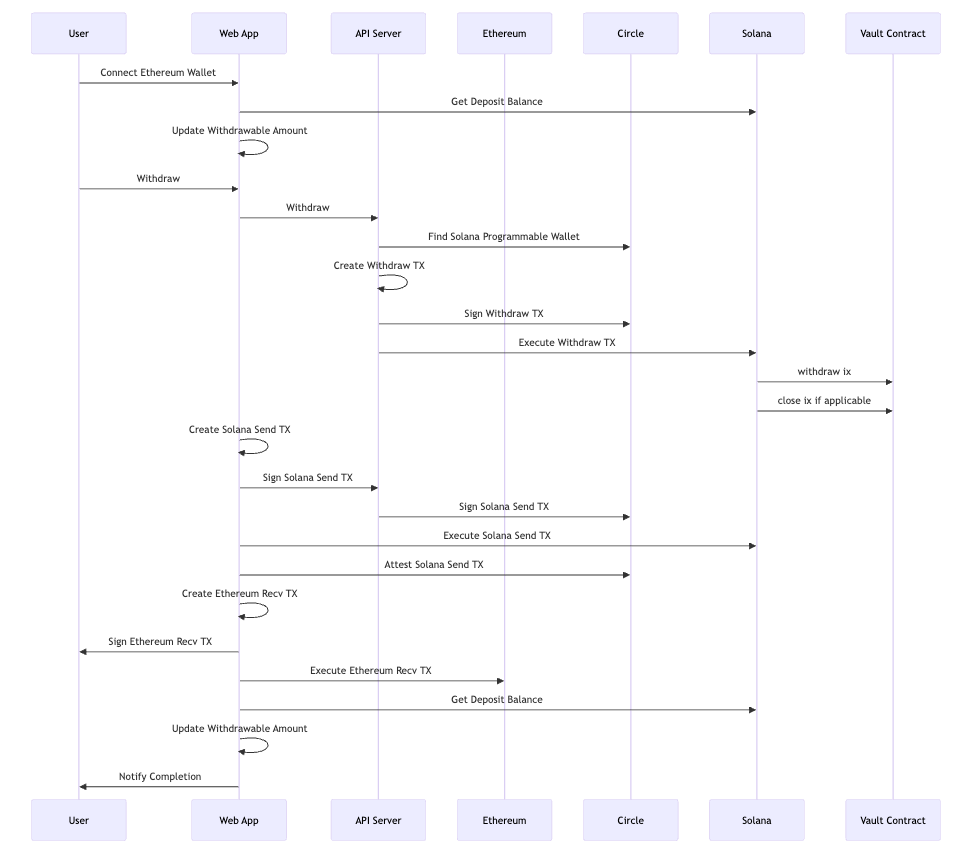

# Overview

We are participating in [Wormhole SIGMA Sprint](https://sigma.wormhole.com/sprint) with this project.

This project implements a mechanism for depositing USDC directly from chains like Ethereum to Windfall on Solana, using the Wormhole TS SDK and Circle CCTP USDC Transfer.

End users can deposit USDC into the Windfall `vault` program deployed on Solana and access services provided by Windfall by simply signing Ethereum transactions.

Note that if bridging to Solana is available, tokens other than USDC can be supported, and thanks to Wormhole, various source chains can be supported for bridging, not limited to EVMs.

Here's how to use the frontend and understand the general flow of operations:

- The end user connects to an EVM-compatible wallet *A* (we used Brave Wallet for testing)
- The backend creates a Circle Programmable Wallet *X* on Solana that is linked to wallet *A*
- When a user initiates a deposit:
  - Wallet *A* signs an EVM-side USDC transfer transaction to initiate the transfer
  - The system waits for Circle Attestation
  - Programmable Wallet *X* signs a Solana-side token receive transaction
  - Programmable Wallet *X* signs a Solana-side Windfall deposit transaction
- When a user initiates a withdrawal:
  - The end user connects their EVM-compatible wallet *A*
  - The backend looks up the Circle Programmable Wallet *X* on Solana that is linked to wallet *A*
  - Programmable Wallet *X* signs a Solana-side Windfall withdrawal transaction
  - Programmable Wallet *X* signs a Solana-side USDC transfer transaction
  - The system waits for Circle Attestation
  - Wallet *A* signs an EVM-side USDC receive transaction

# Demonstration

The demo frontend is deployed at a temporary domain [https://test.softgate.co.jp/](https://test.softgate.co.jp/).



You can use this demonstration site to evaluate the project and observe how it works.
For instructions on using this site, please refer to the demo video submitted for the hackathon.

The backend API server is deployed at [https://api.softgate.co.jp/sigma](https://api.softgate.co.jp/sigma).
The frontend mentioned above is configured to work with this backend API server.

The system operates on the Ethereum Sepolia testnet and Solana devnet.
To perform bridge operations, you will need ETH and USDC on the Sepolia testnet.

You can obtain testnet ETH and USDC through the following faucet services (among others):

- [Alchemy Faucet](https://www.alchemy.com/faucets/ethereum-sepolia) (ETH)
- [Google Faucet](https://cloud.google.com/application/web3/faucet/ethereum/sepolia) (ETH)
- [Circle Faucet](https://faucet.circle.com/) (USDC)

You must also have a compatible wallet installed in your browser that is configured to interact with the Ethereum Sepolia testnet.
This application requires a wallet capable of signing transactions without broadcasting them to the network.
We used the Brave Wallet during development.
We have not verified compatibility with other wallets, and MetaMask is *not* supported due to transaction signing limitations.

# Directory structure

The `frontend` directory contains all the source code for the web application intended for end users. If you want to try out this project yourself, this is the application you'll need to run.

The `api` directory contains the source code for the backend API server. Since the backend requires Circle Web3 Services API keys and other configurations, we recommend using the test server provided by Windfall.

The `program` directory contains the source code for a Solana program called `vault`.
While the `vault` program was copied from another repository and therefore doesn't have much commit history here, development of the `vault` program in the other repository began after the SIGMA Sprint period started.


# How to build

## Frontend

Create `frontend/.env` and specify settings like this:

```shell
NEXT_PUBLIC_ENABLE_TESTNETS = true
NEXT_PUBLIC_API_ENDPOINT = http://localhost:3010
```

`NEXT_PUBLIC_API_ENDPOINT` points to the HTTP API server described in the next section below.

To start the frontend, first navigate to the `frontend` directory and install the required packages:

```shell
npm install
```
Then run the local HTTP server with the following command:

```shell
npm run dev
```

After that, you can access the application by opening `http://localhost:3000` in your browser.

If you need testnet ETH and USDC, you can obtain them through the faucet services listed above.

## Backend (API Server)

Backend is an HTTP API server program that handles interactions with Circle Web3 Services and Windfall's `vault` program on Solana.

First, you need to sign up for Circle Web3 Services and obtain your API key, entity secret, and a wallet set.

Then create `api/.env.development.local` and provide your Circle API-related configurations:

```shell
CIRCLE_API_KEY = <YOUR_CIRCLE_TESTNET_API_KEY>
CIRCLE_ENTITY_SECRET = <YOUR_CIRCLE_ENTITY_SECRET>
CIRCLE_WALLET_SET_ID = <YOUR_CIRCLE_WALLET_SET_ID>
```

Edit `api/.env` to specify the port (otherwise defaults to 3000), blockchain (SOL or SOL-DEVNET), private key for a Solana account that temporarily covers transaction fees, and Solana RPC endpoint. These settings are for the HTTP API server and are not exposed externally.

```shell
PORT = 3010
BLOCKCHAIN = SOL-DEVNET
SOL_PAYER = [123,56,...,78,90]
RPC_ENDPOINT = <YOUR_RPC_ENDPOINT>
TOKEN_MINT = <DEPOSIT_TOKEN_MINT_PUBKEY>
VAULT_TYPE = <VAULT_TYPE_PUBKEY>
```

For devnet, you can use the following settings in `.env` and use the existing vault type which works with devnet USDC:

```shell
TOKEN_MINT = 4zMMC9srt5Ri5X14GAgXhaHii3GnPAEERYPJgZJDncDU
VAULT_TYPE = 2zHQowNu91LJrfaWfpNDMxFXr6DxNYXksYV24UbhBwRX
```

## Solana Program

```shell
anchor keys sync
anchor build
anchor test
```

As of this writing, the `vault` program is deployed on Solana devnet at `DcnDr4dPpXWHkmS8TSXG3bL9dnshCVRRzQi4gTndtUsG`.
It is recommended to use the deployed program as is in most cases.

# Sequence diagrams




